# GrowEasy AI CSV Importer


A production-grade, AI-assisted CSV Importer SaaS application that intelligently extracts and maps heterogeneous, arbitrarily structured CSV datasets into a standardized CRM contact schema.

---

## Why This Project?

Traditional CSV importers rely on rigid, manual column-mapping interfaces where users must match every file header to a predefined database column. This process is error-prone, friction-heavy, and completely breaks when source formats change—such as when importing leads generated from Facebook Ads, Google Ads campaigns, real estate platforms, or manual agency spreadsheets.

The **GrowEasy AI CSV Importer** solves this by utilizing **AI-assisted semantic field mapping**. The system automatically recognizes the semantic intent behind headers like `Primary Phone`, `m_num`, `Email Address`, or `Client Name` and maps their contents into a strict CRM target structure, handling data normalization (e.g. splitting multi-contacts, formatting phone country codes) and validation in a single pass. The objective was to build an importer that prioritizes correctness, maintainability, and production-ready engineering practices over simple CSV parsing.

---

## Highlights

- **AI-Assisted Semantic Mapping**: Intelligently resolves raw, inconsistent CSV headers to standard fields.
- **Arbitrary Column Support**: Works with layouts from Facebook, Google Ads, Excel, and custom reports.
- **Runtime Validation via Zod**: Enforces strong data types and validation checks at the system boundary.
- **Batch Processing**: Groups records into optimal sizes of 15 to minimize API latency and token cost.
- **Exponential Backoff Retries**: Automatically retries failed AI requests with a retry factor of 2.
- **In-Browser CSV Preview**: Instant preview of the first 10 rows without utilizing server bandwidth.
- **Responsive Web Design**: Built with Tailwind CSS, supporting Desktop, Tablet, and Mobile views.
- **Dark Mode**: Seamless theme toggling integrated via Zustand and Tailwind classes.
- **Docker Compose**: Containerized multi-service setup ready for local run and deployment.
- **End-to-End Type Safety**: Shared types and strict TypeScript compiler settings.

---

## High-Level System Architecture

```mermaid
flowchart LR
    subgraph Client [Client Interface - Next.js]
        direction LR
        U[Drag & Drop Upload] --> P[PapaParse Preview] --> C[Confirm Ingestion]
    end
    subgraph Server [Ingestion Backend - Express]
        direction LR
        M[Multer Memory Stream] --> S[csv-parse Stream Reader] --> B[Batching Queue: Chunks of 15] --> LLM[AI Mapping: Gemini / OpenAI]
    end
    subgraph Engine [Validation & Normalization]
        direction LR
        V[Zod Schema Verification] --> N[Normalizer: CC & Split Contacts] --> D[Deduplication Checks] --> R[CRM Result Summary]
    end
    C --> M
    LLM --> V
```



---

## Architecture Principles

- **Type-Safe End-to-End**: Frontend schemas validate file metadata, backend schemas parse REST bodies, and LLM schemas structure raw extraction.
- **Stateless Backend**: The server does not maintain session or database state, processing raw streams and returning structured objects in-memory.
- **AI-Assisted Semantic Mapping**: Large Language Models handle semantic mapping, while standard logic manages batching and execution rules.
- **Layered Architecture**: Responsibilities are strictly segregated between Express controllers, routing handlers, parsing utilities, and AI service wrappers.
- **Fail-Fast Validation**: Schema checks run before invoking downstream AI pipelines to save compute and costs.
- **Small Reusable Components**: Business logic is separated into standalone testable functions.
- **Production-First Error Handling**: Graceful error translations hide system traces from client responses.

---

## Table of Contents

1. [Project Overview](#project-overview)
2. [Assignment Requirements Mapping](#assignment-requirements-mapping)
3. [Features](#features)
4. [Screens & User Interface](#screens--user-interface)
5. [Application & Request Flow](#application--request-flow)
6. [System Architecture](#system-architecture)
7. [Folder Structure](#folder-structure)
8. [Tech Stack Matrix](#tech-stack-matrix)
9. [How AI-Assisted Mapping Works](#how-ai-assisted-mapping-works)
10. [CSV Compatibility Matrix](#csv-compatibility-matrix)
11. [CRM Target Schema Mapping](#crm-target-schema-mapping)
12. [Security Controls](#security-controls)
13. [Performance & Optimization](#performance--optimization)
14. [Challenges & Solutions](#challenges--solutions)
15. [Error Handling Matrix](#error-handling-matrix)
16. [Testing Suite & Edge Cases](#testing-suite--edge-cases)
17. [API Documentation](#api-documentation)
18. [Environment Variables](#environment-variables)
19. [Local Installation](#local-installation)
20. [Docker Configuration](#docker-configuration)
21. [Development & Quality Scripts](#development--quality-scripts)
22. [Production Readiness](#production-readiness)
23. [Design Decisions](#design-decisions)
24. [Trade-offs & Future Enhancements](#trade-offs--future-enhancements)
25. [Known Limitations](#known-limitations)
26. [What I Learned](#what-i-learned)
27. [Contributing](#contributing)
28. [Author](#author)

---

## Project Overview

Importing data via CSV files is one of the most common yet fragile workflows in modern SaaS platforms.

- **Why CSV Imports Are Difficult**: Source files are generated by third-party systems that use custom, inconsistent headers. Users often input data incorrectly, resulting in mismatched quotes, multi-value cells, missing required fields, or raw formatting anomalies.
- **Why AI is Required**: Traditional mapping engines use exact string matching or fuzzy regex rules. If a column is labeled `Cell_Number`, a regex might catch it, but if it is named `Who to Call`, traditional mapping fails. An LLM parses the semantic context of columns, allowing it to correctly identify lead data.
- **Real-World Use Cases**: Sales reps importing lists from different marketing channels (Google Campaign exports, Facebook Lead Ad CSVs, Excel databases, or localized property lists) into a single CRM system without manually adjusting headers beforehand.

---

## Assignment Requirements Mapping

This project is built to satisfy the core objectives of the **GrowEasy Software Developer Assignment**:

| Requirement            | Implementation Details                                                                      | Verified System Component                                                                             |
| :--------------------- | :------------------------------------------------------------------------------------------ | :---------------------------------------------------------------------------------------------------- |
| **Objective**          | Extract CRM leads from arbitrary CSVs using AI.                                             | The backend import service orchestrates parsing, batching, AI mapping, validation, and normalization. |
| **Backend Parsing**    | Node.js streaming parser with `csv-parse` handles input files.                              | Streaming CSV reader service.                                                                         |
| **Zod Validation**     | Strict type-safety and schemas validated at runtime.                                        | Unified CRM Zod validation schema.                                                                    |
| **UI Stepper**         | 4-step wizard: Upload $\rightarrow$ Preview $\rightarrow$ AI Process $\rightarrow$ Results. | Frontend stepper navigation bar.                                                                      |
| **Local Preview**      | Local file parse via `papaparse` before uploading.                                          | Client-side CSV preview hook.                                                                         |
| **Zustand State**      | Global store tracks current step, preview data, and results.                                | Unified global upload Zustand store.                                                                  |
| **Gemini Integration** | Structured outputs via `@google/genai` API config.                                          | Google Gemini structured API client service.                                                          |
| **OpenAI Fallback**    | Key-based config fallbacks to `gpt-4o-mini` if provider is selected.                        | Global AI provider orchestration wrapper.                                                             |
| **Error Handling**     | Operational error responses wrap errors using custom class.                                 | Global Express AppError custom boundary handler.                                                      |
| **Pino Logger**        | Structured logging output formatted as JSON.                                                | Server-side structured Pino logger configuration.                                                     |
| **Visual Tests**       | Playwright snapshot assertions confirm UI layouts.                                          | End-to-end integration visual check tests.                                                            |

---

## Features

### Frontend

- **Drag-and-Drop Ingestion**: Interactive upload zone leveraging `react-dropzone`.
- **Zero-Server Preview**: Parses files locally to verify content and columns before consuming API tokens or bandwidth.
- **TanStack Data View**: Interactive, sortable preview and results tables.
- **Animated State Stepper**: Step tracker utilizing layout transitions.
- **Unified State Management**: Syncs file preview, import metrics, progress, and errors in a Zustand store.
- **Tailwind & shadcn/ui**: Modern component design supporting dark mode.

### Backend

- **In-Memory Streams**: Processes file streams in memory using Node.js `Readable` streams and Multer memory storage.
- **Deterministic Parsing**: Leverages `csv-parse` for streaming and extraction.
- **Limited Concurrency Pooling**: Processes AI requests in batches using a concurrency pool (concurrency limit `3`) to stay within API rate limits.
- **Strict Zod Validations**: Validates request parameters and AI JSON responses.
- **Structured Pino Logging**: Logs request identifiers and durations.

### AI Integration

- **Structured Output Constraining**: Restricts AI models using JSON Schema representations converted from Zod.
- **Gemini Model Fallbacks**: Automatically falls back to alternative model choices (e.g. `gemini-3.5-flash`, `gemini-2.5-flash`, `gemini-2.0-flash`, `gemini-2.5-pro`) if the requested model fails.
- **Exponential Backoff**: Retries failed batches up to 3 times.

### Security

- **Express Rate Limiting**: Limit of 100 imports per 15 minutes per IP.
- **Helmet Security Headers**: Blocks content sniffing and clickjacking.
- **Strict CORS Rules**: Confirms origins against environment configurations.
- **Form & Script Escaping**: Prevents script execution when rendering fields.

---

## Screens & User Interface

### Upload

Allows the user to drag and drop or browse files. Shows support tags for typical formats (Facebook Leads, Google Ads, Excel, CRM Export) and highlights the application's AI capabilities.

### Preview

Presents a scrollable table of the first 10 rows parsed locally. Highlights missing fields (such as phone numbers or emails) and lists file properties (name, size, row/column count).

### Import Progress

Displays step-by-step progress, including a completion bar and details on the batch currently being processed by the AI mapping engine.

### Results (Light Mode)

Displays successful imports in a table alongside an expandable grid of skipped rows (detailing row numbers, categories, reasons, and suggested actions).

### Results (Dark Mode)

Full dark theme styling mapped across all tables, progress elements, and dashboard cards.

---

## Application & Request Flow


---

## System Architecture

The application is structured as a TypeScript monorepo with distinct frontend and backend responsibilities:

- **Frontend (Presentation & Preview)**: The client parses files locally to display previews. Once confirmed, it uploads the file directly to the backend. It does not perform validation or AI mapping.
- **Backend (Authoritative Pipeline)**: The backend reparses the uploaded file from the source stream to ensure integrity. It batches the records, calls the LLM, validates the output, and returns the final CRM records.
- **Communication**: The client sends a `multipart/form-data` request containing the file. All responses follow a standardized JSON envelope containing `success`, `message`, `data`, and optional `error` details.
- **State Management**: Zustand manages client state, coordinating file data, preview content, batch progress, and result sets.
- **Request Lifecycle & Error Flow**: Handled via global Express middleware. Custom AppError structures translate errors into appropriate API responses.

---

## Folder Structure

```text
root
├── backend/                  # Express API Service
│   ├── src/
│   │   ├── config/           # App settings, client initializers, and logger configs
│   │   ├── constants/        # Application constraints and error maps
│   │   ├── controllers/      # Route handler controllers
│   │   ├── errors/           # Custom operational error structures
│   │   ├── middleware/       # Rate limiting, file upload, request ID, and global error handlers
│   │   ├── prompts/          # Versioned LLM instruction templates
│   │   ├── routes/           # REST endpoints
│   │   ├── schemas/          # Zod validation schemas
│   │   ├── services/         # CSV streaming, batch splitting, LLM extraction, and normalizers
│   │   │   ├── ai/           # OpenAI and Gemini integrations
│   │   │   ├── csv/          # Row parser and batching logic
│   │   │   └── import/       # Ingestion orchestration and field normalizers
│   │   └── types/            # Domain interfaces
│   ├── Dockerfile
│   └── tsconfig.json
├── frontend/                 # Next.js 15 Client
│   ├── src/
│   │   ├── app/              # Next.js App Router entry points and layouts
│   │   ├── components/       # UI building blocks (Upload, Preview, Results, Shared)
│   │   ├── config/           # Client configuration settings
│   │   ├── constants/        # Front-end constraints
│   │   ├── hooks/            # PapaParse hook and import triggers
│   │   ├── lib/              # Styling utilities and font loaders
│   │   ├── schemas/          # Client-side input validation schemas
│   │   ├── services/         # Axios client setup
│   │   ├── store/            # Zustand state engine
│   │   └── types/            # Type configurations
│   ├── Dockerfile
│   └── tsconfig.json
├── docs/                     # Architectural decision records and screenshots
│   └── *.md                  # Design specifications (ADRs)
├── tests/                    # E2E test suite
│   └── e2e/                  # Playwright integration specs
├── test-csvs/                # 30 testing files covering edge cases
└── docker-compose.yml        # Orchestration configuration
```

---

## Tech Stack Matrix

| Technology            | Purpose               | Reason Chosen                                                             |
| :-------------------- | :-------------------- | :------------------------------------------------------------------------ |
| **Next.js 15**        | Application Framework | App Router supports hybrid static/dynamic loading and asset optimization. |
| **React 19**          | UI Library            | Built-in support for async transitions and components.                    |
| **TypeScript**        | Type-Safety           | Ensures type-safety across both applications.                             |
| **Zustand**           | State Management      | Lightweight, hook-based store that avoids React context re-renders.       |
| **TanStack Table**    | Data Presentation     | Headless layout system that supports sorting and custom cells.            |
| **PapaParse**         | Local CSV Preview     | Fast browser-side CSV parser that generates immediate previews.           |
| **Node.js / Express** | Backend Platform      | Simple REST routing and stream processing.                                |
| **Multer**            | File Upload Handling  | Memory-buffered file uploads that avoid local disk writes.                |
| **csv-parse**         | CSV Extraction        | High-performance parser that supports Node.js stream pipelines.           |
| **Zod**               | Validation Engine     | Type inference and schema parsing at the network boundary.                |
| **Gemini AI**         | Semantic Engine       | Supports JSON Schema constraining and token usage tracking.               |
| **Pino**              | Structured Logging    | Low-overhead logging that outputs structured JSON.                        |

---

## How AI-Assisted Mapping Works

The application uses Large Language Models to semantically map arbitrary headers to the target schema:

- **Prompt Strategy**: The system instructions define the CRM schema, allowed values, and formatting rules. The user prompt provides the column headers alongside a batch of rows, instructing the model to map the fields without inventing data.
- **Batching**: To manage rate limits and latency, rows are grouped into batches of 15. The batches are processed concurrently in groups of 3.
- **Structured Outputs**: The backend converts the Zod schema to an OpenAPI schema, which is passed to the LLM (using Gemini's `responseSchema` or OpenAI's `zodResponseFormat`) to enforce a structured JSON response.
- **Sanitization**: Before passing schemas to Gemini, the system removes unsupported schema options (like `minLength`, `pattern`, or empty enum strings) and makes all object fields required to ensure consistent structures.
- **Model Fallbacks**: If the primary Gemini model fails, the system automatically falls back to alternative models (`gemini-3.5-flash`, `gemini-2.5-flash`, `gemini-2.0-flash`, `gemini-2.5-pro`) to process the batch.
- **Backoff Retry**: Failed batch requests are retried up to 3 times using exponential backoff (starting at a 500ms delay, doubled on each attempt).
- **Multi-Contact Normalization**: If a row contains multiple emails or phone numbers, the system uses the first value and appends the remaining values to the `crm_note` field.
- **Phone Country Code Extraction**: If a phone number starts with `+`, the country code is extracted to the `country_code` field, and the rest is mapped to `mobile_without_country_code`.
- **Missing Contact Skips**: Rows that lack both an email and a phone number are skipped, and the reason is logged.

---

## CSV Compatibility Matrix

The mapping engine is designed to handle various CSV layouts:

- **Facebook Leads Ads**: Maps headers like `full_name`, `phone_number`, and `email` to standard CRM fields.
- **Google Ads Campaign Exports**: Maps campaign tracking headers like `Created Time` and `Google Status` to standard status fields.
- **Excel / Spreadsheet Exports**: Identifies varied headers like `m_num`, `addr_1`, or `client_details` and maps them appropriately.
- **Messy Datasets**: Handles inputs with missing columns, mixed ordering, trailing commas, or unstructured note fields.

---

## CRM Target Schema Mapping

Arbitrary incoming CSV values are mapped to the following standard target CRM fields:

| Target CRM Field              | Target Type | Validation Rule                                                                            | Description                                          |
| :---------------------------- | :---------- | :----------------------------------------------------------------------------------------- | :--------------------------------------------------- |
| `name`                        | String      | Trimmed; defaults to `""`                                                                  | Full name of the contact.                            |
| `email`                       | String      | Trimmed; converted to lowercase                                                            | Primary email address.                               |
| `country_code`                | String      | Starts with `+`                                                                            | Phone country code.                                  |
| `mobile_without_country_code` | String      | Cleaned digits only                                                                        | Phone number without country code.                   |
| `company`                     | String      | Trimmed; defaults to `""`                                                                  | Associated company name.                             |
| `city`                        | String      | Trimmed                                                                                    | City location.                                       |
| `state`                       | String      | Trimmed                                                                                    | State/province.                                      |
| `country`                     | String      | Trimmed                                                                                    | Country location.                                    |
| `lead_owner`                  | String      | Trimmed                                                                                    | Assigned sales owner.                                |
| `crm_status`                  | Enum        | `GOOD_LEAD_FOLLOW_UP`, `DID_NOT_CONNECT`, `BAD_LEAD`, `SALE_DONE`                          | Status classification.                               |
| `crm_note`                    | String      | Plain text                                                                                 | Contains additional notes or secondary contact info. |
| `data_source`                 | Enum        | `leads_on_demand`, `meridian_tower`, `eden_park`, `varah_swamy`, `sarjapur_plots`, or `""` | Lead source campaign.                                |
| `possession_time`             | String      | Trimmed                                                                                    | Timeline details.                                    |
| `description`                 | String      | Trimmed                                                                                    | General notes.                                       |
| `created_at`                  | String      | ISO String format                                                                          | Creation timestamp.                                  |

---

## Security Controls

- **Environment Variable Containment**: API keys are accessed only on the server.
- **No `dangerouslySetInnerHTML`**: React's native string interpolation is used throughout the application to escape values and prevent XSS.
- **CORS Settings**: The backend limits origins using the configured `FRONTEND_URL` variable.
- **Rate Limiting**: Limits IP addresses to 100 uploads per 15 minutes to prevent abuse.
- **File Upload Constraints**: Express limits uploads to `10 MB` using Multer constraints, and file filters check for `text/csv` MIME types.
- **SQL & Formula Injection**: The application processes data in-memory without database queries, preventing SQL injection. Cell values starting with formula characters (like `=`, `@`, `+`, or `-`) are escaped.
- **Prompt Injection Protection**: The application uses structured JSON schemas to validate all LLM responses, rejecting any output that does not match the expected structure.

---

## Performance & Optimization

- **Stream-Based Parsing**: The backend processes uploads using stream pipelines (`csv-parse`), keeping memory usage low for large files.
- **Concurrency Pool**: AI requests are processed concurrently in groups of 3 to manage rate limits and maintain throughput.
- **Batch Processing**: Chunks of 15 records are sent to the AI in single API calls to optimize token usage.
- **Local In-Browser Preview**: The frontend limits preview rendering to the first 10 rows using PapaParse configuration.
- **Scrollable Table Containers**: CSS overflow containers handle large tables without affecting DOM rendering performance.
- **Virtualization**: _Not Implemented_.

---

## Challenges & Solutions

| Challenge                | Solution                                                                                                            |
| :----------------------- | :------------------------------------------------------------------------------------------------------------------ |
| **Unknown Column Names** | The system uses AI-assisted semantic field mapping to match headers to the CRM schema.                              |
| **Rate Limit Failures**  | Requests are retried up to 3 times using exponential backoff.                                                       |
| **Malformed AI JSON**    | The system enforces structured outputs via JSON Schema, validated using Zod at runtime.                             |
| **Large CSV Files**      | The backend uses stream-based CSV parsing and batches records to process files efficiently.                         |
| **Duplicate Contacts**   | The backend tracks emails and phone numbers in sets during import, skipping duplicate records with a logged reason. |

---

## Error Handling Matrix

| Scenario / Failure Mode     | System Response                                                                        | Error Code            | HTTP Status         |
| :-------------------------- | :------------------------------------------------------------------------------------- | :-------------------- | :------------------ |
| **Invalid CSV structure**   | Parser catches syntax errors and aborts the import.                                    | `CSV_PARSE_ERROR`     | `400`               |
| **Empty file uploaded**     | Validation fails before calling the AI engine.                                         | `CSV_PARSE_ERROR`     | `400`               |
| **Missing required keys**   | Row is skipped if both email and phone numbers are missing.                            | `VALIDATION_ERROR`    | Included in summary |
| **AI Rate Limit (429)**     | Triggers retries. If the batch fails after 3 attempts, the rows are marked as skipped. | `AI_REQUEST_FAILED`   | Included in summary |
| **AI Request Timeout**      | Triggers backoff retries. If unsuccessful, the batch is marked as failed.              | `AI_REQUEST_FAILED`   | Included in summary |
| **Malformed LLM response**  | Secondary Zod validation catches format errors, skips the row, and logs the issue.     | `AI_RESPONSE_INVALID` | Included in summary |
| **IP Rate Limit**           | Global rate limiter blocks requests.                                                   | `RATE_LIMITED`        | `429`               |
| **Network connection loss** | Frontend displays a toast notification and allows the user to retry.                   | `ImportApiError`      | Client handling     |

---

## Testing Suite & Edge Cases

### Test Suites

- **Backend Tests (Jest)**: 93 tests covering controllers, schema validations, and services (75.73% statement coverage).
- **Frontend Tests (Vitest)**: 99 tests covering state stores, custom hooks, and pages (67.45% statement coverage).
- **E2E Integration (Playwright)**: Verifies the upload workflow, local preview rendering, results displays, accessibility controls, dark mode, keyboard navigation, and responsive layouts across viewports.

### Running Tests

To run the test suites, execute the following commands in their respective directories:

```bash
# Run backend tests
cd backend
npm run test

# Run frontend tests
cd frontend
npm run test

# Run E2E tests
npm run test:e2e
```

### Edge Cases Verified

| Scenario                    | System Behavior                                                                    |
| :-------------------------- | :--------------------------------------------------------------------------------- |
| **Missing Email & Phone**   | The record is skipped and listed under validation failures in the summary.         |
| **Duplicate Emails**        | Checked against processed records within the batch. Duplicate records are skipped. |
| **Duplicate Phone Numbers** | Skip reasons are logged for duplicate phone numbers.                               |
| **Mixed/Unknown Headers**   | The AI maps headers to the target fields based on their semantic meaning.          |
| **Unicode & Emojis**        | Supported. System preserves character encodings.                                   |
| **Quoted Commas**           | Handled by the CSV parser to prevent column misalignment.                          |
| **Multiline Fields**        | Supported. The parser processes multiline fields within quotes correctly.          |
| **Incorrect Date Formats**  | The AI attempts normalization, and Zod validates the result.                       |
| **Unknown CRM Status**      | Converted to the default status: `GOOD_LEAD_FOLLOW_UP`.                            |
| **Unknown Data Source**     | Mapped to an empty string `""` if not matched.                                     |

---

## API Documentation

### Endpoint Summary

| Method | Endpoint         | Purpose                                                  |
| :----- | :--------------- | :------------------------------------------------------- |
| POST   | `/api/v1/import` | Upload CSV, parse, process with AI, and return CRM leads |
| GET    | `/api/v1/health` | Service uptime and health diagnostics status check       |

---

### POST /api/v1/import

Uploads and imports a CSV file.

- **Method**: `POST`
- **Content-Type**: `multipart/form-data`
- **Headers**: `x-request-id` (optional, returns UUID if omitted)

#### Request Body

| Parameter | Type         | Required | Description                                           |
| :-------- | :----------- | :------- | :---------------------------------------------------- |
| `file`    | Binary (CSV) | Yes      | File must have a `.csv` extension and be under 10 MB. |

#### Response Envelope (200 OK)

```json
{
  "success": true,
  "message": "CSV import completed successfully",
  "data": {
    "summary": {
      "totalRecords": 10,
      "importedRecords": 8,
      "skippedRecords": 2,
      "validationSkipped": 2,
      "processingFailed": 0
    },
    "records": [
      {
        "created_at": "2026-06-01T10:20:00.000Z",
        "name": "John Doe",
        "email": "john@example.com",
        "country_code": "+91",
        "mobile_without_country_code": "9876543210",
        "company": "Google",
        "city": "Bangalore",
        "state": "Karnataka",
        "country": "India",
        "lead_owner": "Sales Owner",
        "crm_status": "GOOD_LEAD_FOLLOW_UP",
        "crm_note": "Call tomorrow",
        "data_source": "leads_on_demand",
        "possession_time": "",
        "description": ""
      }
    ],
    "skipped": [
      {
        "rowNumber": 16,
        "reason": "Missing both email and mobile number",
        "originalRow": {
          "Client Name": "Rahul",
          "Primary Phone": "",
          "Email Address": "",
          "Firm": "TCS"
        },
        "type": "VALIDATION"
      }
    ]
  }
}
```

#### Error Responses

##### 400 Bad Request

```json
{
  "success": false,
  "message": "Only CSV files are supported",
  "data": null,
  "error": {
    "code": "INVALID_FILE",
    "message": "Only CSV files are supported"
  }
}
```

##### 429 Too Many Requests

```json
{
  "success": false,
  "message": "Too many CSV imports from this IP, please try again after 15 minutes",
  "data": null,
  "error": {
    "code": "RATE_LIMITED",
    "message": "Too many CSV imports from this IP, please try again after 15 minutes"
  }
}
```

##### 502 Bad Gateway (AI Service Failure)

```json
{
  "success": false,
  "message": "AI service encountered an internal error.",
  "data": null,
  "error": {
    "code": "AI_REQUEST_FAILED",
    "message": "AI service encountered an internal error."
  }
}
```

---

### GET /api/v1/health

Returns service health information.

- **Method**: `GET`
- **Response Envelope (200 OK)**

```json
{
  "success": true,
  "message": "Health check successful",
  "data": {
    "status": "UP",
    "version": "1.0.0",
    "environment": "production",
    "timestamp": "2026-07-11T16:30:00Z"
  }
}
```

---

## Environment Variables

### Backend Configuration (`backend/.env`)

| Variable             | Description                                             | Required                      | Default                 |
| :------------------- | :------------------------------------------------------ | :---------------------------- | :---------------------- |
| `PORT`               | Local server port.                                      | No                            | `8000`                  |
| `NODE_ENV`           | Environment mode (`development`, `production`, `test`). | No                            | `development`           |
| `AI_PROVIDER`        | Selection of LLM service (`gemini` or `openai`).        | No                            | `openai`                |
| `GEMINI_API_KEY`     | Key for Google AI Studio.                               | Yes (if provider is `gemini`) | -                       |
| `OPENAI_API_KEY`     | Key for OpenAI.                                         | Yes (if provider is `openai`) | -                       |
| `GEMINI_MODEL`       | Gemini model selection.                                 | No                            | `gemini-2.5-flash`      |
| `OPENAI_MODEL`       | OpenAI model selection.                                 | No                            | `gpt-4o-mini`           |
| `FRONTEND_URL`       | Client URL configuration.                               | No                            | `http://localhost:3000` |
| `DEFAULT_BATCH_SIZE` | Records per processing batch.                           | No                            | `15`                    |

### Frontend Configuration (`frontend/.env.local`)

| Variable              | Description                        | Required | Default                        |
| :-------------------- | :--------------------------------- | :------- | :----------------------------- |
| `NEXT_PUBLIC_API_URL` | API URL configuration for Next.js. | Yes      | `http://localhost:8000/api/v1` |

---

## Local Installation

Ensure **Node.js v22.x** or later and **npm v10.x** or later are installed on your machine.

### 1. Clone the Repository & Install Dependencies

Run this command at the root directory:

```bash
npm install
```

This installs dependencies across the root, backend, and frontend workspaces.

### 2. Configure Environment Files

- In `backend/.env`, configure your keys:
  ```env
  PORT=8000
  NODE_ENV=development
  AI_PROVIDER=gemini
  GEMINI_API_KEY=your_gemini_key_here
  FRONTEND_URL=http://localhost:3000
  ```
- In `frontend/.env.local`, verify the API url:
  ```env
  NEXT_PUBLIC_API_URL=http://localhost:8000/api/v1
  ```

### 3. Launch Development Servers

Start both backend and frontend development servers concurrently using:

```bash
npm run dev
```

- **Frontend Access**: `http://localhost:3000`
- **Backend API**: `http://localhost:8000`

---

## Docker Configuration

The application can be deployed using the root Docker Compose settings:

### 1. Build and Run Containers

To build and start the containers, run:

```bash
docker compose up --build
```

This starts both services and sets up file watch polling (`WATCHPACK_POLLING=true`) on the frontend to support hot reloading.

### 2. Service Access

- **Frontend**: `http://localhost:3000`
- **Backend API**: `http://localhost:8000`

---

## Development & Quality Scripts

Scripts can be run from the root workspace:

```bash
# Run linting checks
npm run lint

# Format codebase using Prettier
npm run format

# Run formatting check
npm run format:check

# Run Playwright E2E tests
npm run test:e2e
```

---

## Production Readiness

- **JSON Logs**: Uses Pino logs formatted as JSON for ingestion into log management tools (such as Datadog, Logstash, or Elastic).
- **Request Tracing**: Mounts a custom request ID middleware to tag all logs and responses with a unique `x-request-id`.
- **Rate Limiting**: Limits requests to protect the import endpoint from abuse.
- **Process Signal Handling**: Registers process handlers for `SIGINT` and `SIGTERM` to close active HTTP ports gracefully.
- **Error Sanitization**: Excludes stack traces from API responses in production environments.

---

## Design Decisions

- **Why Next.js 15 & React 19**: Provides modern layout routing, fast builds, and native support for React components.
- **Why Express**: Lightweight REST engine with simple routing and request lifecycle middleware.
- **Why Gemini 2.5/3.5 Flash**: Selected for JSON schema constraining, context window capabilities, and cost efficiency.
- **Why TypeScript**: Ensures type-safety across the monorepo.
- **Why Zod**: Ensures schema validation at runtime.
- **Why Zustand**: Minimizes re-renders and simplifies state management compared to React Context or Redux.
- **Why PapaParse**: Selected for fast, in-browser CSV parsing to generate local previews.
- **Why csv-parse**: Selected for memory-efficient stream parsing on the backend.
- **Why Batching**: Chunks of 15 records balance API latency, rate limits, and processing costs.
- **Why Docker Compose**: Standardizes environments and simplifies local development.

---

## Trade-offs & Future Enhancements

- **Database Persistence**: _Not Implemented_. Data is processed in-memory and returned to the client. This keeps the application simple and focused on the mapping task, but requires the client to store the results.
- **XLS/XLSX Ingestion**: _Not Implemented_. The application is limited to CSV files to focus on the semantic mapping pipeline. Support for XLS/XLSX files is planned for a future release.
- **Background Jobs Queue**: _Not Implemented_. Heavy imports are processed synchronously, which can block HTTP connections. A background worker (e.g. using BullMQ and Redis) is planned for a future release.
- **Deduplication Limits**: Deduplication is performed on the current file import only. Verification against an external CRM database is planned for a future release.

---

## Known Limitations

- **AI Provider Quotas**: High-volume imports can exceed Gemini/OpenAI rate limit quotas, resulting in skipped batches.
- **Deduplication Boundary**: Duplicate detection is limited to verification within the single uploaded CSV file.
- **XLS/XLSX Support**: Spreadsheet files are intentionally unsupported, requiring conversion to CSV format before import.
- **Synchronous Execution**: The backend processes imports synchronously over HTTP, which may lead to connection timeouts on large files.
- **Stateless Backend**: Processing results are not persisted by the backend service. All data is returned to the client.

---

## What I Learned

- **Structured Output Engineering**: Converting validation schemas (Zod) to JSON Schemas to ensure consistent LLM outputs.
- **Resilient Pipeline Design**: Constructing ingestion systems that handle network losses, provider failures, and data structure variations.
- **Stream Ingestion Processing**: Leveraging Node.js stream pipelines to parse data without disk operations.
- **LLM Rate-Limit Mitigation**: Managing rate limits through batch chunking, concurrency throttling, and exponential backoff retry.
- **Type-Safe API Contracts**: Aligning frontend and backend schemas using Zod validation.

---

## Contributing

1. Fork the repository.
2. Create a feature branch: `git checkout -b feature/amazing-feature`.
3. Format and test your changes: `npm run format && npm run test`.
4. Commit your changes: `git commit -m 'Add amazing feature'`.
5. Push to the branch: `git push origin feature/amazing-feature`.
6. Open a Pull Request.

---

## Author

**Sumit Dubey**  
Built as part of the GrowEasy Software Developer Assignment.

- **Email**: [sumitdvivedi2504@gmail.com](mailto:sumitdvivedi2504@gmail.com)
- **LinkedIn**: [linkedin.com/in/sumit-dubey-68780a2a7](https://www.linkedin.com/in/sumit-dubey-68780a2a7/)
- **GitHub**: [github.com/sumit-ai-labs](https://github.com/sumit-ai-labs)
